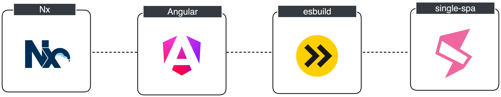

# Single-Spa with Angular v17+ and native ESM




## What is this?

This is an example Nx monorepo demonstrating how single-spa can be used for microfrontends with the new Angular builder based on Vite/esbuild.

Goals:
- [x] Angular micro-frontend apps, served/bundled as native ES Modules by Vite/esbuild
- [x] Leverage native browser importmap support
- [x] Support for having multiple importmaps (thanks to [import-map-injector](https://github.com/single-spa/import-map-injector))
- [x] Support for external importmaps (thanks to [import-map-injector](https://github.com/single-spa/import-map-injector))
- [x] Support for overriding importmaps (thanks to [import-map-overrides](https://github.com/single-spa/import-map-overrides))
- [x] Route-based loading of micro-frontends (handled by [single-spa](https://single-spa.js.org))
- [x] Live-reload functionality during development
- [x] Share dependencies between Angular micro-frontends


## Want to learn more?

I've written some more in-depth background in a seprate markdown doc. I encourage you to read it if you are interested to learn more about the reasoning behind all of this: [background.md](./doc/background.md)


## Try it out

To get started, first we need to install our dependencies:

``` bash
pnpm i
```

> NOTE: `pnpm` has a nice patch feature, which I use sometimes to unblock Nx or Angular upgrades: https://pnpm.io/cli/patch.

To run the application, we need to start the dev-server on each of the apps in the repo:
 - the app-shell (the root html file with importmaps etc)
 - the host module (MF orchestration logic, or in simple terms: some vanilla JS that calls `singleSpa.registerApplication()`)
 - the navbar MF
 - the 2 main MF apps (cats and dogs)

To do this, we could open 5 separate terminal windows and run the `serve` target for each of these apps separately (e.g. `pnpm nx serve app-shell` etc).

OR, to make it easier, we can run the `dev` script which leverages Nx to start them all at once in parallel:

``` bash
pnpm dev
```

Give it a few seconds until all the dev servers are up-and-running. Then we are ready to see it in action by opening the app-shell url in our browser: `http://localhost:4300/`


## Override the importmap

One feature that makes this architecture really shine, is the ability to override specific modules in the importmap, for local development. To enable this, we used the [import-map-overrides](https://github.com/single-spa/import-map-overrides) library (we load this script from our app-shell page).

To try it out, you can follow these steps:

Step 1. Serve 1 micro-frontend app locally. For example:
``` bash
pnpm nx serve cats
```

Step 2. Visit deployed application in your browser: https://single-spa-angular-esm.vercel.app/


Step 3. Open the JS console and execute the following javascript command
``` bash
localStorage.setItem('overrides-ui', true)
```

Step 4. Refresh the page in the browser.


Step 5. Now you should see a yellow-ish rounded square button near the bottom-right corner of the page. Click it, and override the module named `@myorg/cats` with the URL of the locally served micro-frontend app: `http://localhost:4201/main.js`


Step 6. Refresh the page once more. Now you are set up to start making local changes to the cats app and see these changes reflected in the browser immediately 🎉🚀